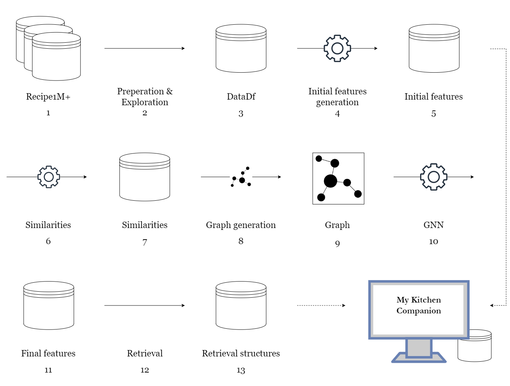
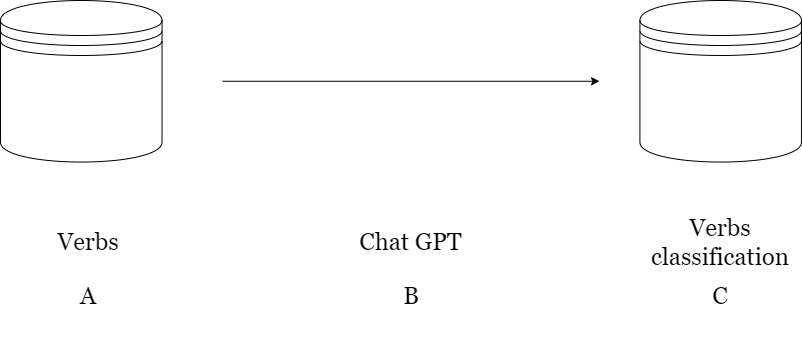
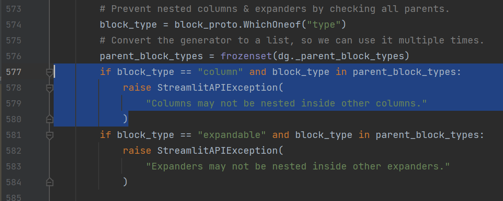
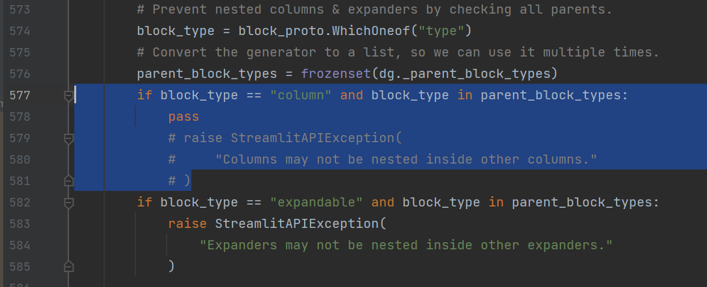

# My kitchen companion

Welcome to our _My Kitchen Companion_ prototype code!

In this `README` file we'll present the architecture of our code.

The purposes of this file are:

1. Overview the project schema in a "code-architecture" manner. That is, tell the story of our project in a way that
   you'll understand where **every file** in the folder structure is involved in the overall process. _NOTE!_ This
   section doesn't involve running instructions, and it includes information that is not necessarily relevant except for
   showing our work to the examiner.
2. Provide instructions for running the project on your machine.

Reader requirements - In this document, we assume the reader is familiar with the problem we attempt to solve, and with
our basic approach.

## Project schema

The story of our project starts from two distinct data sources. The major one in described at the _Main pipeline_
subsection, where the other one is described at the _secondary pipeline_ subsection.

### Main pipeline

Our main pipeline includes all the offline computations needed for generating the final embeddings of the recipes. In
the figure below there's an overview of the pipeline, and below it the story of the pipeline.

1. We start from a database called Recipe1M+ and can ne found [here](https://arxiv.org/abs/1810.06553). The raw
   downloaded files, as well as the download link, can be found in the `data/row` folder.
2. The file `data_preparation.py` builds one unified view in the form of a pd.DataFrame, out of the many raw files.
   Among other things, it filters out all the recipes without nutritional value. The file's output is the
   dataframe `data/data_df.pkl`. The notebook `data_exploration.ipynb` provides a basic exploration of the data,
   including the distribution of different ingredients and verbs. The notebook produces
   the `data/initial_features/flavors/first_ingredients.pkl` file, which is a list of the first 1300 most common
   ingredients. Together, they make up more than 95% of all the ingredients in the data.
3. The products of the first stage -  `data_df.pkl`, `first_ingredients.pkl`.
4. Next, a series of notebooks are used to produce the initial features, produced using a set of carefully applied
   rules. The notebook is located in the `initial_features` folder.
    1. The notebook `initial_features/flavors_from_gpt.ipynb` iterates the `first_ingredients.pkl` file and generates
       queries for [chatGPT](https://openai.com/blog/chatgpt/) to classify the different ingredients to one of five
       options - sweet, sour, salty, spicy or other. The notebook produced
       the `data/initial_features/flavors/temp_dict_x` files, which are the processed outputs of chatGPT.
    2. The notebook `initial_features/rep_flavors.ipynb` combines the `temp_dict_x`'s to produce one file
        - `ingredients_flavors.pkl`, in the same folder as the others. The notebook also
          produces `data/initial_features/rep_flavors.pkl` - a DF with the initial flavors features of the recipes.
    3. The notebooks `rep_healthiness.ipynb`, `rep_temperature.ipynb` and `rep_time.ipynb` in `initial_features` produce
       the files `rep_health.pkl`, `rep_temp.pkl` and `rep_times.pkl` in `data/initial_features` respectively. These
       files contain the initial features representation of the recipes in the form of a DF. The notebook that processes
       the temperatures uses a chatGPT classification of the verbs for verbs that indicate cold and hot recipes, as
       discussed in the secondary pipeline.
    4. The notebook `initial_features/total_representation.ipynb` combines the different representations and filters out
       recipes that haven't been classified into at least one taste. It also iterates the combinations that can be
       deduced from the interface and assigns each one with a feature vector. It produces the final initial
       representation file `data/initial_features/initial_features_dict.pkl`. Furthermore, the notebook sample 10,000
       recipes and filters out the others, to speed up the process. The data of the filtered recipes is saved in
       the `data/data_df_filtered.pkl` DF file.
5. The structures of the initial features process as described above, primarily `data_df_filtered.pkl`
   and `initial_features_dict.pkl`.
6. To build the GNN graph, there are several types of similarities to calculate. First, Recall that every node in a
   graph is a recipe, and an edge is drawn between two recipes if the similarity between their tf-idf representations is
   high enough (according to a pre-defined threshold). The notebook `tf_idf_calculator.ipynb` calculates the
   recipe-recipe similarities and produces the file `data/tf_idf_similarities.pkl` (DF). Recall that every inputted
   feature combination from the interface is also a node in the graph, and an edge between a combination node and a
   recipe node is drawn if the cosine similarity between the initial representation of the two is high enough. The
   notebook `comb_recipe_similarity.ipynb` calculates the similarities between the different combinations and the
   recipes, and produces the file `data/comb_recipe_similarities.pkl`.
7. The structures of the similarity calculation phase as described above.
8. Now, it's time to use the similarities calculated in the previous step to generate the required structures for the
   graph. The notebook `graph_generation.ipynb` loads the similarities, as well as the final initial embeddings, and
   generate the structure `data/G_data.pkl` - a dict that contains the required information - the graph's node and
   edges, indexers for the nodes and so on.
9. The graph structure, `data/G_data.pkl`.
10. Now, it's time for learning! The graph is fed into a graph neural network, in which weight matrices are learned, and
    the model is trained to optimally propagate information between its nodes. After the training phase, the model is
    used to finally generate the final embeddings for the recipes and inputted combinations, and the
    file `data/final_features.pkl` is produced.
11. The `final_features.pkl` of the recipes and combinations.
12. Next, the auxiliary notebook `retrival_structures.ipynb` is used to load the final features and to create an
    efficient structure that would optime the online retrieval. The notebook produces the
    file `data/closest_recipes.pkl`.
13. This file contains, for each inputted combination of interface features, a 10,000-entry list with the order of the
    closest recipes, w.r.t to cosine similarity of the final embeddings.

Finally, the interface is fed with the closest recipes for each combination, as well as the recipes themselves. Recall
the interface enables the user to examine several recipes for each inputted combination. To do so, it has to maintain a
file with the lastly presented recipe. This is the `data/index_file.txt` file.

### Secondary pipeline

The secondary pipeline described in the figure below is a small one.

- A - The source is the `verbs.txt` file - a list of the most popular verbs in English, to which we manually added
  cooking verbs that appeared among the recipes.
- B - The verbs were manually inserted into chatGPT, which was asked to classify them into verbs that indicate cold /
  hot cooking.
- C - The classified verbs are then saved into two lists in the files `cold_words.txt`, and `hot_words.txt` in
  the `data/initial_features/temperature` folder.

### Others

Except for the two pipelines, there are a few more files here, which are described here.

1. In the `.streamlit` folder, there's the config file that defines the interface theme.
2. The `subprojects` contains several subprojects we used as 'case studies' to learn new functionalities, like the use
   of streamlit, GNNs, and tf-idf vectorization.
3. the `utils.py` file contains constants that are used across the different notebooks, as well as some functionalities
   that are used for the interface.
4. In the `data/others` folder, there are the two diagrams of the pipeline, and the [_
   draw.io_](https://app.diagrams.net/) file to produce them, as well as other code snapshots that are described below.

## Running instructions

Even though it's completely possible given the above instructions, running the entire pipeline is useless. Instead, it
should be enough to run the streamlit interface to experiment with the prototype. Few requirements are needed for a
successful load and operation of the interface.

### 1. Files

The interface uses to following files:

1. `data/closest_recipes.pkl`
2. `data/data_df_filtered.pkl`
3. `data/initial_features/flavors/first_ingredients.pkl`

To run the interface, make sure the files exist, and in the correct sub-folders.

**NOTE!** Some of the above files were too big to fit into the GitHub repo, and therefore will be missing if the repo is
being cloned. We highly command to avoid cloning the repo from GitHub, and instead download it from the link to our
OneDrive folder, provided in the report (and
also [here](https://technionmail-my.sharepoint.com/:f:/g/personal/matan-so_campus_technion_ac_il/EscqxbhWIh1KoeL4YJMFmssBqCR4APolabp6knpM0YrlSA?e=glxUc8))
. Access is granted for anyone in the Technion with the link.

### 2. Streamlit modifications

To design our interface to be similar as possible to the prototype presented in _Milestone 2_ (and not only for
compatibility reasons, but also to meet the design standards) we had to **slightly change the source code of the
streamlit package**. Without the proper adjustments, the code will probably fail. Here we'll describe the one simple
adjustment we have made, meant to bypass Streamlit's avoidance of nested columns.

1. Locate the `delta_generator.py` file in streamlit's source code in use. The file is located in streamlit's root
   directory.
    1. If you use Conda distribution as we do, you may find it
       in `...\anaconda3\Lib\site-packages\streamlit\delta_generator.py`. If you use several Conda environments, make
       sure to change the appropriate one.
    2. If you run into trouble with finding the file, it may be easier to ignore this step and proceed to run the
       interface. The interface will load in the browser, but will soon present an error message. Looking at the error
       trace, we can find the path to the `delta_generator.py` file.

2. Search for the error raised in the case of nested columns. It should look like the following:

In our version of streamlit (1.17.0), it starts in line 577, but you may find it by looking for the below row in the
file:

    if block_type == "column" and block_type in parent_block_types:

3. Replace the 3 `raise StreamlitAPIException` lines with `pass`. After the modification, it should look like this:

### 3. Run the app

You're all set. Open your terminal and navigate to the root directory of our project. Make sure the environment in which
you changed the source code is activated, and all the required files exists where they should be. The following line
should open the interface in your default browser:

    streamlit run interface.py

Enjoy, and bon appetit :)

### 4. Our note

We have been working EXTREMELY hard on this project, and to make sure everything is working appropriately. If, for some
reason, you run into problems with running our project, please contact us, and we will be happy to help. It's a complex
project, but we did everything in our power to make it work :)

Thank you in advance,

Matan Solomon | matan-so@campus.technion.ac.il

Nitay Suissa | nitay.suissa@campus.technion.ac.il

